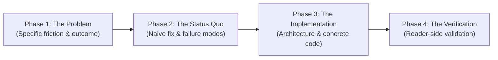

# Documenting Skill

A structured, battle-tested standard for creating **actionable, problem-first technical documentation** that respects the reader's time and guarantees working results.

Every document produced with this skill must be readable in **under 5 minutes** and deliver a **reproducible solution**.

---

## The 4-Phase Documentation Framework

Every topic documentation must follow these four consecutive phases in order as an **editorial narrative flow**.

> [!IMPORTANT]
> **Narrative Flow, NOT Literal Headings**: The 4 phases represent the cognitive journey of the reader, **NOT literal heading titles**. Never name your markdown sections `## 1. Problem & Scope` or `## 2. Current Way`. Instead, write descriptive, domain-relevant headings (e.g., `## The Embedding Dilemma: Precision vs. Context` or `## Why Sliding-Window Overlap Fails`).
>
> **No Redundant Metadata Callouts or Duplicate H1s**:
> - Never output `# Post Title` at the top of markdown; the site layout already renders `{title}` as the `<h1>`.
> - Never add manual `> ⏱️ Read time: ... > 🎯 Goal: ...` blockquotes in the body; reading time, publish date, and post descriptions are already rendered natively by the blog layout.



### Phase 1: Problem & Topic Scope (Narrative Opening)
- **Goal**: Hook the reader immediately by defining the exact pain point and what this topic solves.
- **Heading Style**: Dive straight into the text or use a technical heading describing the constraint (e.g., `## The Thundering Herd at Cache Expiry`).
- **Key Questions Answered**:
  - What failure, bottleneck, or friction occurs?
  - Who does this affect, and under what conditions?
  - What is the concrete deliverable?
- **Rule**: Start directly with the technical reality. Avoid throat-clearing filler ("In modern distributed web systems...").

### Phase 2: Current Way to Solve the Problem (The Status Quo)
- **Goal**: Expose the limitations, risks, or costs of the conventional / naive workaround.
- **Heading Style**: Name the workaround and its defect (e.g., `## Why Mutex Locks Cause Cascading Latency`).
- **Key Questions Answered**:
  - How do developers usually try to bypass this today?
  - Why does that approach fall short under production load or edge cases?
- **Value**: Gives the reader the necessary contrast to value the proposed solution.

### Phase 3: Implementation of the Solution (The Architecture & Code)
- **Goal**: Deliver a concrete, copy-paste-ready, and production-grade solution.
- **Heading Style**: Name the solution/pattern implemented (e.g., `## Building the Zero-Lock XFetch Wrapper`).
- **Requirements**:
  - Step-by-step instructions with clear file paths, shell commands, or configuration snippets.
  - Accompanied by a **visual diagram** (see [Visuals & Diagrams](#visuals--diagrams)).
  - Complete code without hand-wavy `// do something here` placeholders.

### Phase 4: Testing & Verification (Reader-Side Validation)
- **Goal**: Guarantee the reader can verify the solution works directly in their environment.
- **Heading Style**: Focus on the verification method (e.g., `## Verifying with an Offline Benchmark`).
- **Requirements**:
  - Explicit execution commands (curl, test script, CLI command).
  - **Expected outputs**: show the exact stdout/JSON response the user will see.
  - Negative/edge case sanity checklist.

---

## Core Rules & Constraints

### 1. The 5-Minute Reading Rule
- **Word Count Limit**: 500 – 800 words maximum per topic.
- **Reading Speed**: Standard tech documentation reading speed is ~180–220 words per minute plus code scanning.
- **Focus**: A topic must solve **one specific problem**. Do not bundle multiple loosely coupled solutions into one article.
- Always include an estimated read time at the top: `⏱️ Read time: ~3-4 minutes`.

### 2. Must Deliver a Working Solution
- Every topic **must** end with a solved state.
- If a problem is too open-ended, narrow the scope until a concrete, verifiable solution can be provided.
- Avoid open-ended think-pieces or theoretical overviews without an actionable implementation.

### 3. Visuals & Diagrams (Mandatory)
Humans parse visual architecture and sequences 60,000x faster than raw text.
- **Include at least one diagram or visual aid per topic**:
  - **Mermaid Flowchart**: For decision trees, control flow, or state transitions.
  - **Mermaid Sequence Diagram**: For request/response lifecycles, caching flows, or inter-service communication.
  - **Mermaid Architecture / Class / ER Diagram**: For component relationships or data models.
  - **ASCII Tables / Terminal Mockups**: For CLI outputs, memory layouts, or data tables.
- **Syntax & Rendering Rules**:
  - Always write diagrams in fenced ` ```mermaid ` code blocks.
  - Quote node labels with special characters like parentheses or colons to prevent parse failures: `node["Label (Details)"]`.
  - Ensure the hosting layout has Mermaid rendering enabled (e.g., dynamic `mermaid` import with dark/light mode reactivity).
- Keep diagrams uncluttered (max 4–7 nodes/participants).

### 4. Thumbnail Generation (Mandatory `heroImage`)
Every topic documentation and blog post must feature a high-quality 16:9 thumbnail for post headers, catalog cards, and OpenGraph/Twitter social previews.
- **Aspect Ratio**: `16:9` (e.g., 1920×1080 standard landscape).
- **Style Aesthetic**: Technical editorial / graphic novel line art or sharp architectural diagram, high contrast ink work, dark/light theme compatible. Avoid cluttered or illegible text inside the artwork.
- **Generation Workflow**:
  1. Call the `generate_image` tool:
     - `AspectRatio`: `'16:9'`
     - `ImageName`: `'<topic_slug>_thumb'` (lowercase, max 3 words)
     - `Prompt`: Describe the technical concept visually (e.g., *"Technical architectural illustration of container namespaces and cgroups, graphic novel line art, high contrast..."*).
  2. Copy the generated image from `<appDataDir>/brain/<conversation-id>/...` to the workspace's public directory:
     `public/images/<topic-slug>.jpg` (or `.png`).
  3. Reference it in the document's YAML frontmatter:
     ```yaml
     ---
     title: "..."
     description: "..."
     heroImage: "/images/<topic-slug>.jpg"
     ---
     ```

### 5. Multi-Part Splitting Strategy (> 5 Minutes)
If a problem is complex and cannot be completely solved and verified within a 5-minute read:
1. **Decompose the solution** into sequential, self-contained milestones:
   - *Example*: Rather than one 15-minute guide on "End-to-End Distributed Caching", split into:
     - **Part 1**: Cache-Aside Pattern with Fallback (3 min)
     - **Part 2**: Stampede Prevention with Probabilistic Early Expiration (4 min)
     - **Part 3**: Multi-Region Invalidation with Redis Pub/Sub (4 min)
2. **Every part must have its own working solution & verification**: A part cannot be "just theory" while waiting for Part 2.
3. **Mandatory Bidirectional Breadcrumbs**:
   - At the very top:
     ```markdown
     > **Part 2 of 3 in the Distributed Caching Series**  
     > [← Previous: Part 1 - Cache-Aside Basics](./part-01.md) | [Next: Part 3 - Multi-Region Invalidation →](./part-03.md)
     ```
   - At the bottom (Next Steps):
     ```markdown
     ---
     ### What's Next?
     In [Part 3: Multi-Region Invalidation](./part-03.md), we scale this solution across data centers using Redis Pub/Sub.
     ```

---

## Quick Reference Resources

- [Single Topic Template](./templates/single-topic-template.md): Copy-paste scaffold for single-topic guides.
- [Multi-Part Template](./templates/multi-part-template.md): Template for multi-part series with navigation breadcrumbs.
- [Worked Example: Cache Stampede Solution](./examples/example-caching-solution.md): A complete topic meeting all criteria.
- [Documentation Quality Rubric](./references/documentation-rubric.md): Pre-publish quality checklist.

---

## How Agents Should Execute This Skill

When tasked with documenting a topic:
1. **Clarify Scope & Read Time**: Assess if the topic fits in < 5 mins (~600 words). If not, outline the multi-part division first.
2. **Follow the 4 Phases**: Draft headers matching Phase 1 through Phase 4.
3. **Draft the Visual**: Write a clear Mermaid diagram illustrating the problem vs. solution flow.
4. **Draft Verification Steps**: Write the reader-side test command and expected output before concluding.
5. **Self-Audit**: Run through [references/documentation-rubric.md](./references/documentation-rubric.md) to ensure word count and reproducibility criteria are met.
