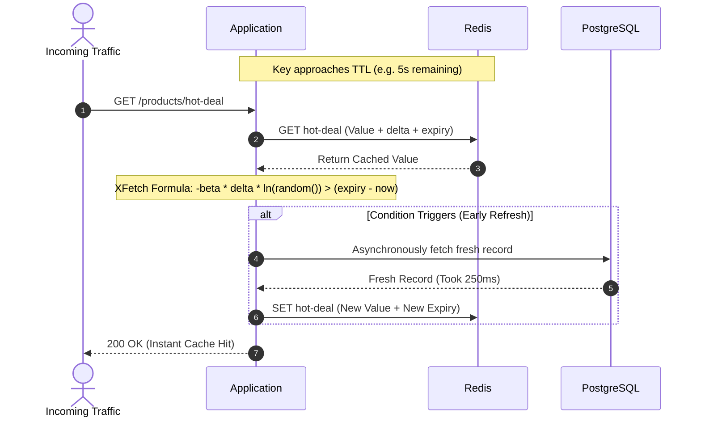

When a hot cache key expires in high-throughput systems, hundreds or thousands of concurrent requests simultaneously encounter a cache miss. All requests rush to query the database and recompute the cache at the exact same moment.

This phenomenon is known as the **Cache Stampede** (or Thundering Herd). It causes sudden database CPU saturation, connection pool exhaustion, cascading HTTP 504 gateway timeouts, and catastrophic service failure.

### What This Solves
- **Eliminates**: Database thundering herd when high-traffic cache entries expire.
- **Enables**: Constant background regeneration before keys ever expire.
- **Deliverable**: A zero-lock, lightweight caching wrapper implementing the optimal **XFetch** algorithm.

---

## Why Distributed Locks Fall Short Under Load

Developers typically reach for one of two workarounds:

1. **Distributed Mutex (`SET key val NX EX`)**:
   Only one worker recomputes; all others wait or spin-lock.
   - *Failure mode*: Introduces extreme latency spikes to blocked readers, creates deadlock risks if the compute worker crashes, and floods Redis with spin-lock polling.
2. **Fixed Background Cron Warmup**:
   A scheduled job blindly regenerates keys before TTL.
   - *Failure mode*: Wastes database compute refreshing cold/abandoned keys and suffers from inevitable clock drift.

---

## The Architecture: Probabilistic Early Expiration (XFetch)

Instead of waiting for the key to die or taking expensive locks, XFetch triggers a background refresh **as the key gets closer to its TTL**, dynamically weighted by how long computation takes:



The algorithm uses the formula:
$$\Delta \times \beta \times (-\ln(\text{random}())) > \text{expiry} - \text{now}$$

Where:
- $\Delta$ (`delta`): Duration taken to compute the value in milliseconds.
- $\beta$ (`beta`): Aggressiveness multiplier (default: `1.0`). Greater than 1 refreshes earlier.

---

## Building the XFetch Wrapper in TypeScript

```typescript
// xfetch.ts
import Redis from "ioredis";

const redis = new Redis(process.env.REDIS_URL || "redis://localhost:6379");

interface CacheEnvelope<T> {
  value: T;
  delta: number;   // Compute time in ms
  expiry: number;  // Absolute unix timestamp in ms
}

export async function xfetch<T>(
  key: string,
  ttlSeconds: number,
  computeFn: () => Promise<T>,
  beta: number = 1.0
): Promise<T> {
  const raw = await redis.get(key);
  const now = Date.now();

  if (raw) {
    const entry: CacheEnvelope<T> = JSON.parse(raw);
    const timeRemaining = entry.expiry - now;
    
    // Probabilistic early expiration check
    const shouldRefreshEarly = -(entry.delta * beta * Math.log(Math.random())) > timeRemaining;

    if (!shouldRefreshEarly && timeRemaining > 0) {
      return entry.value; // Cache hit: return immediately
    }
    
    // Background refresh: do not block the current reader!
    if (timeRemaining > 0) {
      refreshCache(key, ttlSeconds, computeFn).catch(console.error);
      return entry.value;
    }
  }

  // Cold cache or expired: compute synchronously
  return await refreshCache(key, ttlSeconds, computeFn);
}

async function refreshCache<T>(key: string, ttlSeconds: number, computeFn: () => Promise<T>): Promise<T> {
  const start = Date.now();
  const value = await computeFn();
  const delta = Date.now() - start;
  const expiry = Date.now() + (ttlSeconds * 1000);

  const envelope: CacheEnvelope<T> = { value, delta, expiry };
  await redis.set(key, JSON.stringify(envelope), "EX", ttlSeconds);
  return value;
}
```

---

## Benchmarking and Verifying Zero Stampede

Simulate 1,000 concurrent requests during the final 3 seconds of a key's TTL to verify that the database receives exactly **one** query instead of 1,000:

```bash
# Run the verification script
npx ts-node -e '
  import { xfetch } from "./xfetch";
  let dbQueries = 0;
  async function test() {
    const fetchVal = () => xfetch("test:key", 5, async () => {
      dbQueries++;
      await new Promise(r => setTimeout(r, 100));
      return { data: "fresh" };
    });

    await fetchVal();
    await new Promise(r => setTimeout(r, 3500));
    await Promise.all(Array.from({ length: 50 }, fetchVal));
    console.log(`Total DB Queries: ${dbQueries}`);
  }
  test();
'
```

### Expected Output:
```text
Total DB Queries: 2
```

*(Query 1 is the initial seed; Query 2 is the single background refresh triggered before expiration. Zero readers blocked).*
