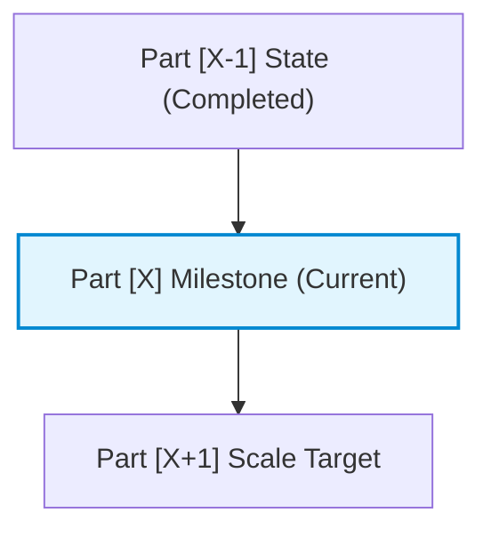

> 📚 **Part [X] of [Total]** in the *[Series Name]* Series  
> 🧭 **Navigation**: [← Previous: Part [X-1] Title](./part-[X-1].md) | [Next: Part [X+1] Title →](./part-[X+1].md)

<!-- PHASE 1: Scoped problem for this specific part -->
In [Part [X-1]: Previous Milestone](./part-[X-1].md), we solved [brief recap]. However, that introduces a new constraint: **[State the specific problem solved in this milestone]**.

### What This Part Delivers:
- **Sub-Problem Solved**: [Specific pain point]
- **Deliverable**: [Concrete component built in this milestone]
- **Prerequisites**: Completion of [Part [X-1]](./part-[X-1].md).

---

<!-- PHASE 2: Limitations of naive scaling from the prior part -->
## Why the Simple Extension Breaks

[Explain why simply repeating or naively extending the previous milestone falls short.]

---

<!-- ARCHITECTURE & VISUAL -->
## Architecture for Part [X]



---

<!-- PHASE 3: Concrete implementation for this part -->
## Implementing Part [X]

```typescript
// Concrete code for this milestone
```

---

<!-- PHASE 4: Verification of this part before advancing -->
## Validating Part [X]

Validate that Part [X] functions properly before moving to the next article:

```bash
# Verification command
curl -s http://localhost:8080/api/v1/milestone-[X]
```

### Expected Output:
```json
{
  "status": "success",
  "milestone": "part-[X]-verified"
}
```

---

## 🧭 Series Roadmap

| Part | Topic | Status |
| :--- | :--- | :--- |
| **Part 1** | [Part 1 Title](./part-01.md) | Completed |
| **Part [X]** | **This Article** | Current |
| **Part [X+1]** | [Part [X+1] Title](./part-[X+1].md) | Next up |

👉 **Continue to [Part [X+1]: Title →](./part-[X+1].md)** to learn how to [One sentence hook for next part].
