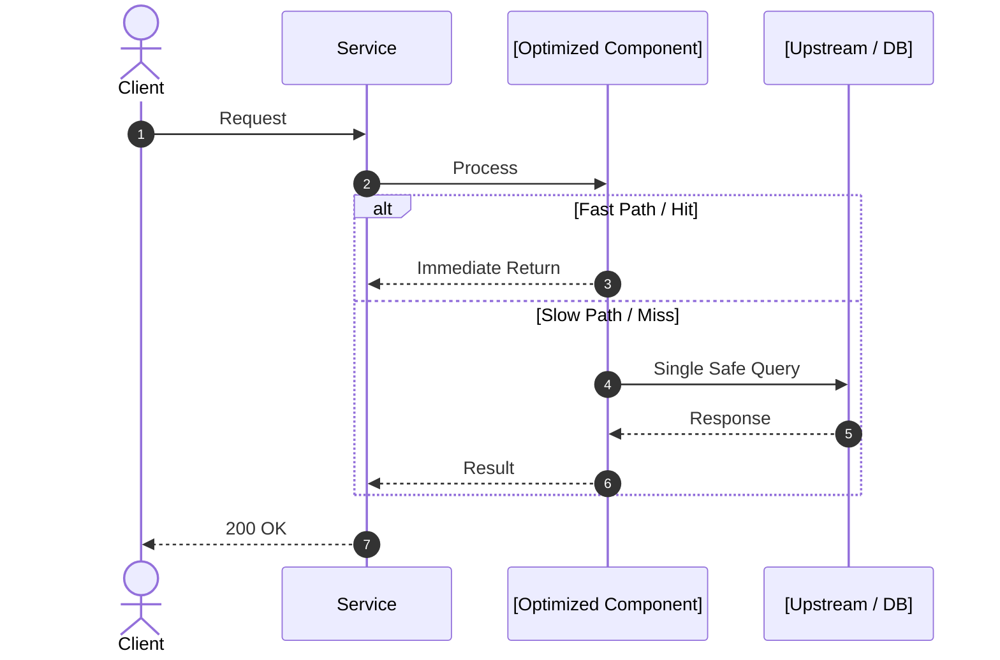

<!-- 
NOTE: Do NOT add a duplicate # Title or manual "Read time / Goal" callout. 
The site layout automatically displays the title, reading time, date, and description.
-->

<!-- PHASE 1: Hook the reader immediately with the exact technical friction point -->
[Describe the friction point directly without throat-clearing. E.g., "When high-traffic cache keys expire simultaneously, hundreds of concurrent threads flood the database with identical queries..."]

### What This Solves
- **Eliminates**: [Root failure mode / Bottleneck]
- **Enables**: [Target capability / Throughput increase]
- **Deliverable**: [Concrete code / component built in this guide]

---

<!-- PHASE 2: Expose why the naive/status quo workaround breaks -->
## Why the Conventional Approach Fails

[Explain the workaround developers typically try and why it degrades under production conditions.]

```text
[Current Approach] ───> [Hidden Race Condition / Lock Contention] ───> [Service Latency / Outage]
```

### Limitations:
1. **[Failure Mode 1]**: [Details]
2. **[Failure Mode 2]**: [Details]

---

<!-- ARCHITECTURE & VISUAL: Mandatory Mermaid diagram -->
## The Architecture: [Pattern Name]

[Explain the mental model of the solution before diving into raw code.]



---

<!-- PHASE 3: Concrete, copy-pasteable, production-ready code -->
## Building the [Solution Name]

[Walk through the implementation concisely.]

### Step 1: [Prerequisite or Type Definitions]

```typescript
// Production-ready types / interfaces
```

### Step 2: [Core Implementation Logic]

```typescript
// Core implementation without pseudo-code placeholders
```

---

<!-- PHASE 4: Reproducible reader-side verification -->
## Validating the Solution

Run the verification command from your terminal:

```bash
# Executable verification command
curl -s -i http://localhost:8080/health
```

### Expected Output:
```text
HTTP/1.1 200 OK
Content-Type: application/json
{"status":"healthy","verified":true}
```

### Sanity Checklist:
- [ ] Output matches expected response code / schema.
- [ ] No race conditions, deadlocks, or error spikes in service logs.
- [ ] The original bottleneck is verified as eliminated.
