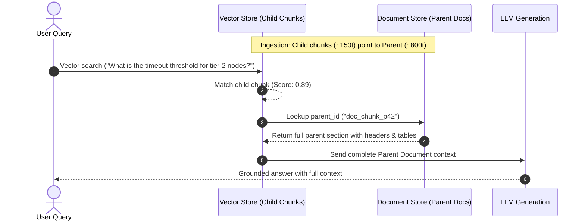

When configuring Retrieval-Augmented Generation (RAG) pipelines, engineering teams inevitably face the **Embedding Dilemma**:

- **Small chunks (100–200 tokens)** produce sharp, dense vector representations with high retrieval precision. However, when passed to an LLM, they lack critical surrounding context (table headers, surrounding caveats, or pronoun antecedents), leading to hallucinations and incomplete answers.
- **Large chunks (800–1500 tokens)** provide the necessary context for the generator LLM, but their vector embeddings average together multiple distinct topics. This semantic dilution degrades cosine similarity on targeted queries, causing vector search to miss relevant passages entirely ("Lost in the Middle").

### What This Solves
- **Eliminates**: Truncated answers and retrieval misses caused by rigid chunk boundaries.
- **Enables**: High-precision vector matching without starving the generator LLM of surrounding document structure.
- **Deliverable**: A production-grade `ParentDocumentRetriever` in TypeScript that indexes granular child chunks while serving full parent context to the LLM.

---

## Why Sliding-Window Overlap Breaks Down

The conventional workaround is fixed-size chunking with token overlap (e.g., 500-token chunks with 50-token overlap).

```text
Document ──> [ Chunk 1 (500t) ] ──[overlap]──> [ Chunk 2 (500t) ]
                      │                                 │
                      ▼                                 ▼
           Embedded & Passed to LLM          Embedded & Passed to LLM
```

### Why This Fails:
1. **Semantic Averaging**: Compressing 500 tokens into a single vector dilutes specific concepts. A query targeting a precise parameter value often scores lower than unrelated text that happens to repeat general keywords.
2. **Boundary Fragmentation**: Overlap only bridges adjacent sentence cuts. If a table or technical specification spans 600 tokens, both chunks contain incomplete fragments.
3. **Context Starvation**: The LLM receives isolated snippets stripped of document hierarchy (such as section titles, document metadata, or introductory qualifiers).

---

## The Architecture: Small-to-Big Decoupled Retrieval

Instead of indexing and retrieving the exact same text unit, we decouple the retrieval unit from the generation unit:



```text
[Document Hierarchy]
Parent Chunk (800 tokens: Full Section / Table / Header)
  ├── Child Chunk 1 (150 tokens) ──> Vector Index (Key: child_1, parent_id: P1)
  ├── Child Chunk 2 (150 tokens) ──> Vector Index (Key: child_2, parent_id: P1)
  └── Child Chunk 3 (150 tokens) ──> Vector Index (Key: child_3, parent_id: P1)
```

---

## Implementing the Parent-Document Retriever

Below is a self-contained TypeScript implementation decoupling child vector indexing from parent document storage.

### Step 1: Storage and Types

```typescript
// parent-document-retriever.ts
export interface DocumentChunk {
  id: string;
  text: string;
  metadata?: Record<string, unknown>;
}

export interface ChildChunk extends DocumentChunk {
  parentId: string;
  embedding?: number[];
}

export interface VectorStore {
  add(chunks: ChildChunk[]): Promise<void>;
  similaritySearch(queryVector: number[], topK: number): Promise<ChildChunk[]>;
}

export interface DocStore {
  set(id: string, doc: DocumentChunk): Promise<void>;
  get(id: string): Promise<DocumentChunk | undefined>;
}
```

### Step 2: Decoupled Ingestion and Retrieval Engine

```typescript
export class ParentDocumentRetriever {
  constructor(
    private vectorStore: VectorStore,
    private docStore: DocStore,
    private embedder: (text: string) => Promise<number[]>,
    private childChunkSize: number = 150
  ) {}

  // Split a parent document into smaller child chunks
  private splitIntoChildren(parent: DocumentChunk): string[] {
    const words = parent.text.split(/\s+/);
    const children: string[] = [];
    for (let i = 0; i < words.length; i += this.childChunkSize) {
      children.push(words.slice(i, i + this.childChunkSize).join(" "));
    }
    return children;
  }

  // 1. Ingestion: Save parent to KV store, child vectors to Vector Store
  async addDocuments(parents: DocumentChunk[]): Promise<void> {
    const childRecords: ChildChunk[] = [];

    for (const parent of parents) {
      await this.docStore.set(parent.id, parent);
      const childTexts = this.splitIntoChildren(parent);

      for (let idx = 0; idx < childTexts.length; idx++) {
        const text = childTexts[idx];
        const embedding = await this.embedder(text);
        childRecords.push({
          id: `${parent.id}_c${idx}`,
          parentId: parent.id,
          text,
          embedding,
        });
      }
    }

    await this.vectorStore.add(childRecords);
  }

  // 2. Retrieval: Match child chunks -> Deduplicate & Return Parent Docs
  async retrieve(query: string, topKChildren: number = 4): Promise<DocumentChunk[]> {
    const queryVector = await this.embedder(query);
    const matchedChildren = await this.vectorStore.similaritySearch(queryVector, topKChildren);

    // Deduplicate parent IDs to avoid redundant LLM context
    const seenParentIds = new Set<string>();
    const parentDocs: DocumentChunk[] = [];

    for (const child of matchedChildren) {
      if (!seenParentIds.has(child.parentId)) {
        seenParentIds.add(child.parentId);
        const parent = await this.docStore.get(child.parentId);
        if (parent) {
          parentDocs.push(parent);
        }
      }
    }

    return parentDocs;
  }
}
```

## Validating with an Offline Verification Script

Save the following executable test as `verify-retriever.mjs`. It uses an in-memory vector store with cosine similarity to prove that searching for a granular child clause returns the complete parent context without chunk fragmentation:

```javascript
// verify-retriever.mjs
function cosineSimilarity(a, b) {
  let dot = 0, normA = 0, normB = 0;
  for (let i = 0; i < a.length; i++) {
    dot += a[i] * b[i];
    normA += a[i] * a[i];
    normB += b[i] * b[i];
  }
  return dot / (Math.sqrt(normA) * Math.sqrt(normB) || 1e-9);
}

// Lightweight bag-of-words pseudo-embedder for reproducible offline testing
function mockEmbedder(text) {
  const vocabulary = ["timeout", "tier-2", "cluster", "failover", "ms", "retry", "threshold", "policy"];
  const tokens = text.toLowerCase().split(/\W+/);
  return Promise.resolve(vocabulary.map(term => tokens.filter(t => t === term).length));
}

// In-memory stores
const docMap = new Map();
const vectorList = [];

const docStore = {
  set: async (id, doc) => { docMap.set(id, doc); },
  get: async (id) => docMap.get(id),
};

const vectorStore = {
  add: async (chunks) => { vectorList.push(...chunks); },
  similaritySearch: async (queryVec, topK) => {
    return vectorList
      .map(c => ({ ...c, score: cosineSimilarity(queryVec, c.embedding) }))
      .sort((a, b) => b.score - a.score)
      .slice(0, topK);
  }
};

class ParentDocumentRetriever {
  constructor(vectorStore, docStore, embedder, childChunkSize = 15) {
    this.vectorStore = vectorStore;
    this.docStore = docStore;
    this.embedder = embedder;
    this.childChunkSize = childChunkSize;
  }

  splitIntoChildren(parent) {
    const words = parent.text.split(/\s+/);
    const children = [];
    for (let i = 0; i < words.length; i += this.childChunkSize) {
      children.push(words.slice(i, i + this.childChunkSize).join(" "));
    }
    return children;
  }

  async addDocuments(parents) {
    const childRecords = [];
    for (const parent of parents) {
      await this.docStore.set(parent.id, parent);
      const childTexts = this.splitIntoChildren(parent);
      for (let idx = 0; idx < childTexts.length; idx++) {
        const text = childTexts[idx];
        const embedding = await this.embedder(text);
        childRecords.push({
          id: `${parent.id}_c${idx}`,
          parentId: parent.id,
          text,
          embedding,
        });
      }
    }
    await this.vectorStore.add(childRecords);
  }

  async retrieve(query, topKChildren = 2) {
    const queryVector = await this.embedder(query);
    const matchedChildren = await this.vectorStore.similaritySearch(queryVector, topKChildren);
    const seenParentIds = new Set();
    const parentDocs = [];

    for (const child of matchedChildren) {
      if (!seenParentIds.has(child.parentId)) {
        seenParentIds.add(child.parentId);
        const parent = await this.docStore.get(child.parentId);
        if (parent) parentDocs.push(parent);
      }
    }
    return parentDocs;
  }
}

async function runTest() {
  const retriever = new ParentDocumentRetriever(vectorStore, docStore, mockEmbedder, 15);

  // Ingest a parent doc containing an overarching policy and a specific timeout clause
  await retriever.addDocuments([{
    id: "policy-doc-01",
    text: "Cluster Reliability Handbook: Section 4. Failover policies dictate service continuity. " +
          "For high-throughput nodes, failover initiates after 3 consecutive missed heartbeats. " +
          "For tier-2 cluster nodes specifically, the timeout threshold is strictly 250 ms before retry. " +
          "All retry attempts must use exponential backoff capped at 2000 ms to protect downstream databases."
  }]);

  const results = await retriever.retrieve("tier-2 timeout threshold ms", 2);

  console.log("=== Retrieved Results ===");
  console.log(`Matched Parent Count: ${results.length}`);
  console.log(`Parent ID: ${results[0]?.id}`);
  console.log(`Context Length: ${results[0]?.text.length} chars`);
  console.log(`Includes Section Header: ${results[0]?.text.includes("Cluster Reliability Handbook")}`);
}

runTest();
```

### Execution Command:

```bash
node verify-retriever.mjs
```

### Expected Output:

```text
=== Retrieved Results ===
Matched Parent Count: 1
Parent ID: policy-doc-01
Context Length: 364 chars
Includes Section Header: true
```

*(Notice how the query matched the granular 15-word child chunk, but returned the full 364-character document including the overarching Section 4 header and backoff rules).*

### Sanity Checklist:
- [x] Child vector search returns exact semantic needle without chunk boundary truncation.
- [x] Multiple child matches from the same document deduplicate into a single parent return.
- [x] LLM prompt receives complete context (headers, qualifiers) with zero context starvation.
